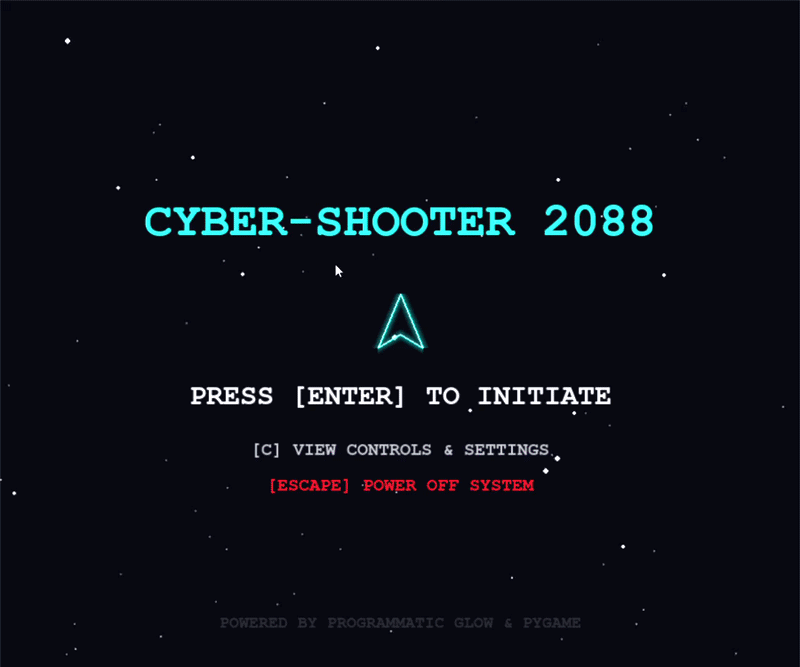
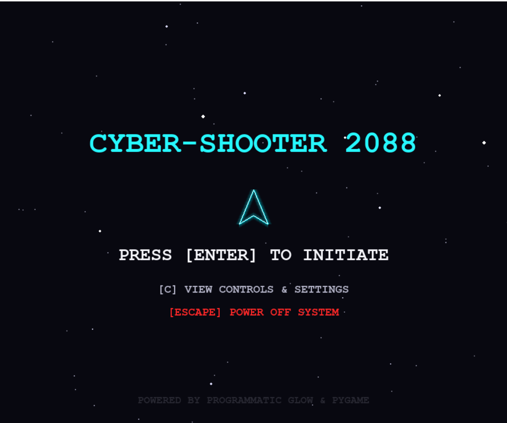
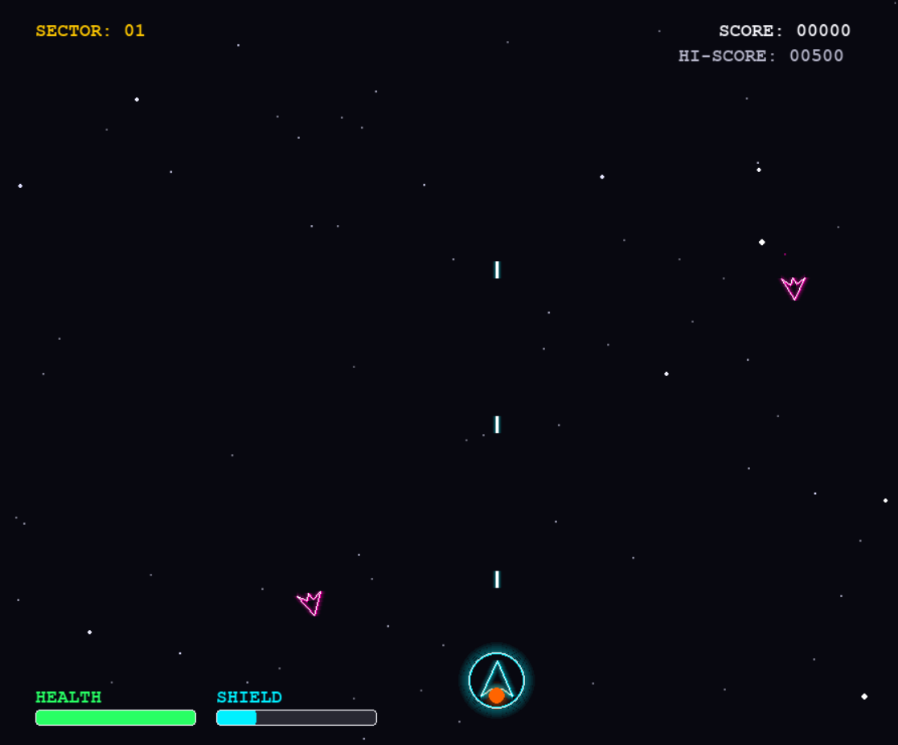
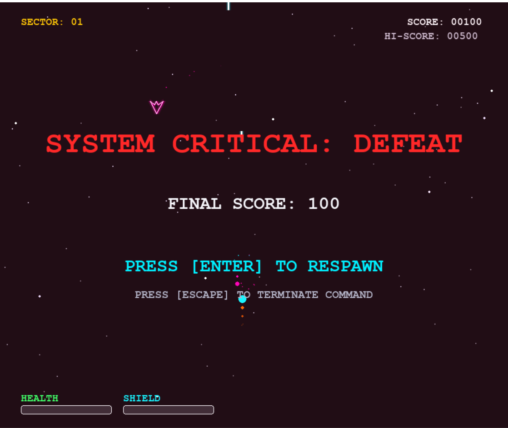

#  Space Shooter

A fast-paced 2D arcade shooter built with Python and Pygame.

---

## 🎮 Gameplay

<p align="center">
  
</p>

---

## 📸 Screenshots

<p align="center">
  
  
  
</p>

---

##  Features

-  Smooth spaceship movement
-  Multiple enemy types
-  Boss battles
-  Score & High Score
-  Retro sound effects
-  Health system

---

## 🎮 Controls

| Key | Action |
|------|--------|
| A / D or ← / → | Move |
| Space | Shoot |

---

## ⚙️ Installation

```bash
pip install -r requirements.txt
python game.py