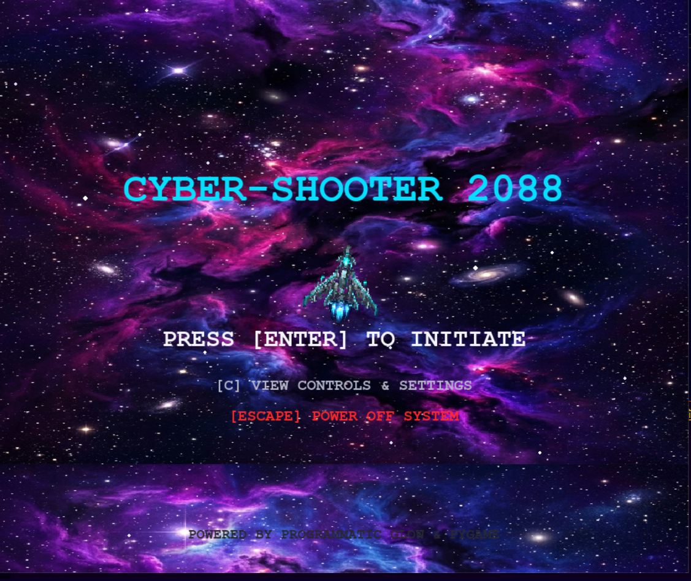
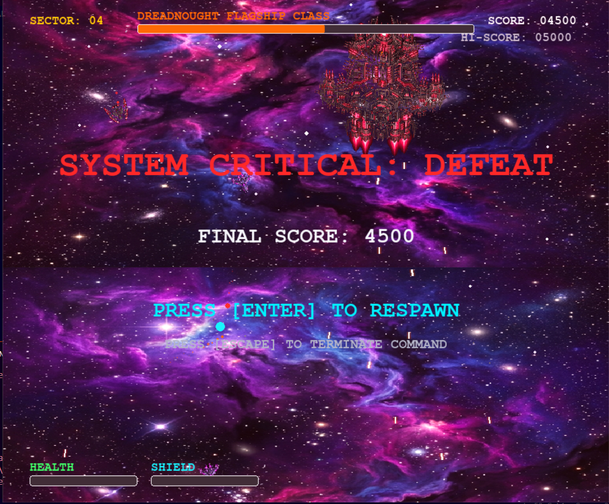

# 🚀 Space Shooter


An arcade-style 2D Space Shooter built in **Python** using the **Arcade** game development library.

Pilot your spaceship, destroy incoming enemies, survive as long as possible, and achieve the highest score while avoiding enemy collisions.

---

##  Gameplay

<p align="center">
  
</p>

---

##  Screenshots

<p align="center">
  
  
</p>

---

##  Features

###  Gameplay
- Smooth player movement
- Real-time enemy spawning
- Projectile shooting system
- Collision detection
- Score tracking
- Lives/health system
- Game Over screen
- Main Menu screen

###  Visuals
- Custom game sprites
- Animated gameplay
- Responsive UI
- Background graphics
- Explosion effects

###  Audio
- Background music
- Shooting sound effects
- Explosion sound effects

###  Programming Concepts
- Object-Oriented Programming
- Event-driven game loop
- Sprite management
- Collision detection algorithms
- Keyboard input handling
- Random enemy generation
- Game state management

---

##  Built With

| Technology | Purpose |
|------------|---------|
| Python | Programming Language |
| Arcade | Game Development Framework |
| Pyglet | Rendering & Window Management |

---

##  Controls

| Key | Action |
|-----|--------|
| ⬅️ Left Arrow | Move Left |
| ➡️ Right Arrow | Move Right |
| Spacebar | Shoot |
| Esc | Exit Game |

---

##  Getting Started

### Clone the repository

```bash
git clone https://github.com/avika677/space_shooter.git
```

### Navigate into the project

```bash
cd space_shooter
```

### Install dependencies

```bash
pip install -r requirements.txt
```

### Run the game

```bash
python game.py
```

---

##  Project Structure

```
space_shooter/
│
├── assets/
│   ├── gameplay.gif
│   ├── menu.png
│   └── defeatmenu.png
│
├── game.py
├── requirements.txt
├── README.md
└── ...
```

---

##  Future Improvements

- Boss battles
- Multiple enemy types
- Power-ups
- High-score saving/
- Difficulty progression
- Pause menu
- Multiple levels

---

##  What I Learned

While building this project, I gained hands-on experience with:

- Object-Oriented Programming
- Building a complete game loop
- Sprite rendering
- Collision detection
- Event handling
- Managing game states
- Python game development using Arcade
- Structuring a complete software project

---

##  Repository

If you enjoyed this project or found it useful, consider giving it a ⭐ on GitHub!

---

##  Author

**Avika Saxena**

Computer Science Student | Python Developer | Aspiring AI & Software Engineer